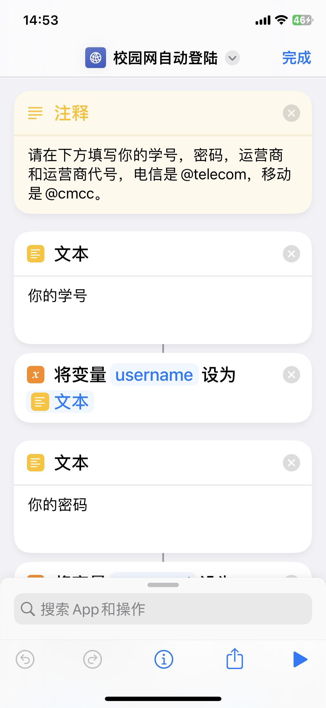
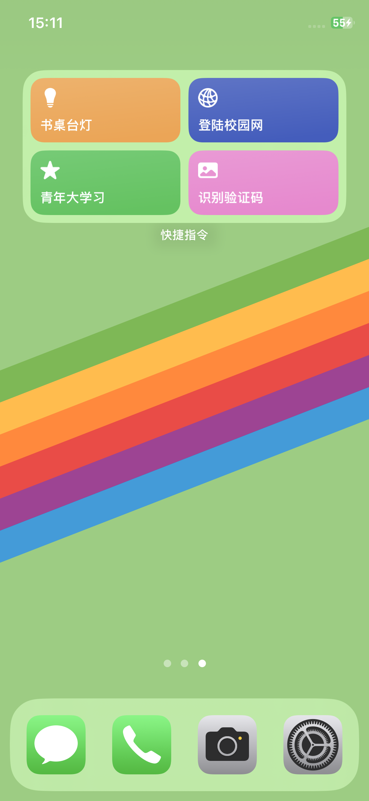

# 南京工业大学校园网自动登录脚本 iPhone 版

## 1. 使用

本人因为换了个二手的 iPhone，又有一次机会在哔哩哔哩上发现 iPhone 的快捷指令也可以做自动登录，于是在我前面研究的基础上，我写了这个快捷指令。

使用很简单，使用 iPhone 打开下面的链接，修改里面的**学号**，**密码**，**运营商**和**运营商代号**就可以了。你可以像我一样添加到主页，使用起来更加方便。

> 注意：此快捷命令只在 **IOS16** 的系统上测试过

- [校园网自动登录快捷指令链接](https://www.icloud.com/shortcuts/b7f4c9464f4e4e129020077e893ff9bb)

|            自动登录脚本            |             主页快捷指令             |
| :--------------------------------: | :----------------------------------: |
|  |  |

## 2. 说明

了解本项目的其他分支情况可参考此[Wiki 页面](https://github.com/MR-Addict/Njtech-Home-Autologin/wiki)
